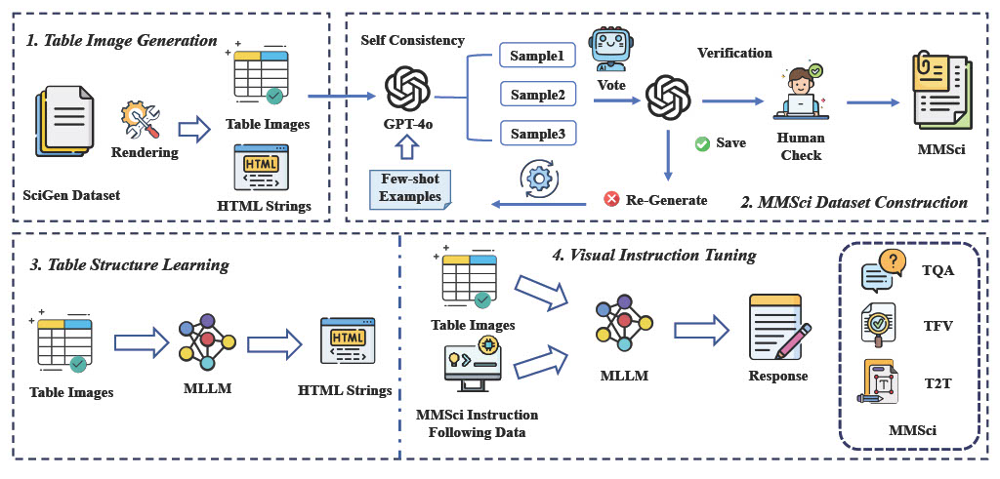
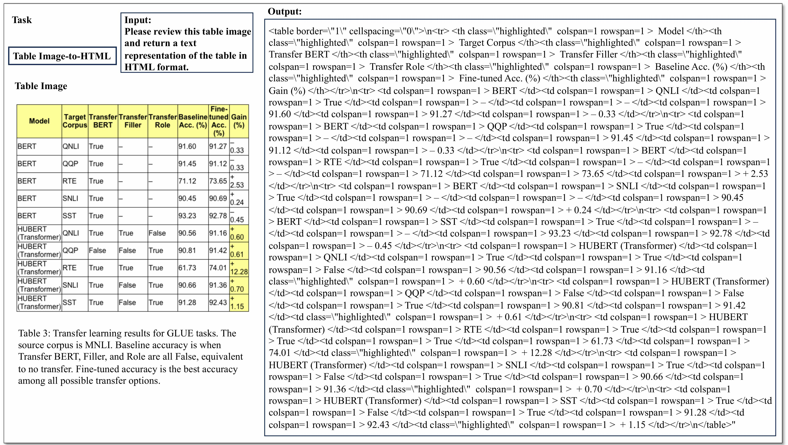
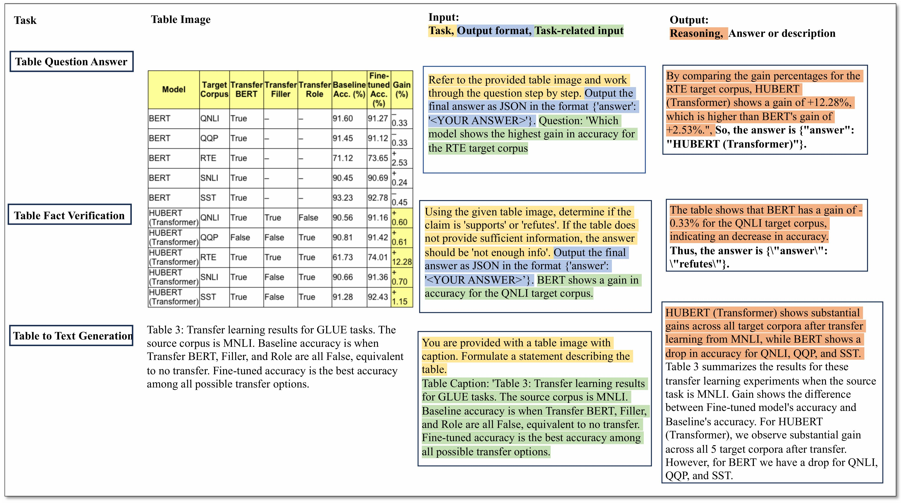
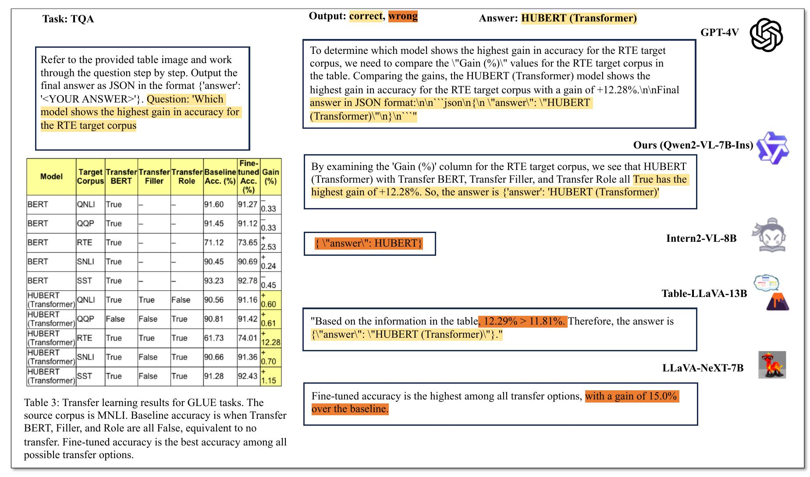
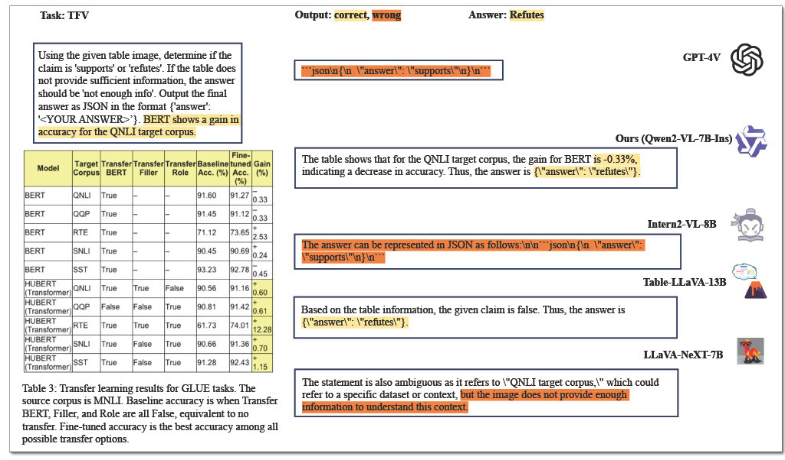

# MMSci_Table

Dataset for the paper "[Does Table Source Matter? Benchmarking and Improving Multimodal Scientific Table Understanding and Reasoning](https://arxiv.org/abs/2501.13042)"

# MMSci Dataset Collection

The MMSci dataset collection consists of three complementary datasets designed for scientific multimodal table understanding and reasoning: MMSci-Pre, MMSci-Ins, and MMSci-Eval.

## Dataset Summary

- **MMSci-Pre**: A domain-specific pre-training dataset containing 52K scientific table structure recognition samples
- **MMSci-Ins**: An instruction tuning dataset with 12K samples across three table-based tasks
- **MMSci-Eval**: A benchmark with 3,114 testing samples for numerical reasoning evaluation

## Framework Overview

*Figure 1: Overview of the MMSci framework showing the four key stages: Table Image Generation, Dataset Construction, Table Structure Learning, and Visual Instruction Tuning.*

## Dataset Details

### MMSci-Pre
- **Size**: 52K samples
- **Format**: Table image-to-HTML pairs
- **Source**: Scientific papers from SciGen dataset
- **Purpose**: Table structure learning and alignment of visual features with textual representations
- **Features**:
  - High-quality HTML format tables
  - Rendered table images preserving structural integrity
  - Complex layouts and relationships from scientific papers
  - Focus on tables with significant numerical values

*Figure 2: Example from MMSci-Pre dataset showing the table image and its corresponding HTML representation.*

### MMSci-Ins
- **Size**: 12K samples
- **Format**: Instruction-following samples with reasoning steps
- **Tasks**:
  - Table Question Answering (TQA)
  - Table Fact Verification (TFV)
  - Table-to-Text Generation (T2T)
- **Features**:
  - Detailed step-by-step reasoning processes
  - Balanced distribution across three tasks
  - Each table paired with one TQA, TFV, and T2T task
  - Built upon scientific domain tables

*Figure 3: Example from MMSci-Ins dataset showing instruction-following samples across different tasks.*

### MMSci-Eval
- **Size**: 3,114 samples
- **Purpose**: Comprehensive evaluation of numerical reasoning capabilities
- **Features**:
  - Testing samples across TQA, TFV, and T2T tasks
  - Focus on numerical reasoning assessment
  - Based on SciGen dataset test set
  - Diverse reasoning types and complexity levels

## Dataset Creation

The datasets were created through a rigorous process:
1. Collection of raw tabular data from SciGen dataset
2. Transformation of textual tables into HTML format
3. Rendering of HTML tables into high-quality images
4. Generation of instruction-following samples with reasoning steps
5. Quality assurance through balanced task distribution

## Intended Uses

- Pre-training multimodal language models for table understanding
- Fine-tuning models for specific table-based tasks
- Evaluating numerical reasoning capabilities in scientific contexts
- Benchmarking table understanding and reasoning systems

#### Table Question Answering (TQA)

*Figure 4: Example of a TQA task showing the question, reasoning steps, and answer.*

#### Table Fact Verification (TFV)

*Figure 5: Example of a TFV task showing the statement, verification process, and conclusion.*

## Citation

If you found this repository or paper is helpful to you, please cite our paper
